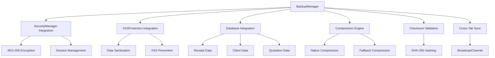

# BackupManager Enterprise - Documentación Técnica

## 🚀 Sistema de Backup Automático Enterprise-Grade

Este documento describe la implementación completa del sistema de backup automático que complementa perfectamente el SecurityManager y XSSProtection existentes en ciaociao.mx.

## 📋 Índice

1. [Características Principales](#características-principales)
2. [Arquitectura del Sistema](#arquitectura-del-sistema)
3. [Integración con Sistemas Existentes](#integración-con-sistemas-existentes)
4. [Configuración e Instalación](#configuración-e-instalación)
5. [API y Funciones](#api-y-funciones)
6. [Seguridad y Encriptación](#seguridad-y-encriptación)
7. [Métricas y Monitoreo](#métricas-y-monitoreo)
8. [Casos de Uso](#casos-de-uso)
9. [Troubleshooting](#troubleshooting)

## 🎯 Características Principales

### ✅ Backup Automático
- **Backup Completo**: Copia completa de todos los datos
- **Backup Incremental**: Solo cambios desde el último backup
- **Scheduling Inteligente**: Programación automática basada en heurísticas
- **Cross-Tab Synchronization**: Coordinación entre múltiples pestañas

### 🔐 Seguridad Enterprise
- **Encriptación AES-256**: Integración con SecurityManager existente
- **Verificación de Integridad**: Checksums SHA-256 para cada backup
- **Sanitización XSS**: Integración con XSSProtection para datos seguros
- **Recovery Points**: Puntos de recuperación seguros

### 📊 Gestión Inteligente
- **Compresión Automática**: Reducción de espacio de almacenamiento
- **Auto-Cleanup**: Eliminación automática de backups antiguos
- **Versionado**: Control de versiones de backups
- **Métricas en Tiempo Real**: Monitoreo y estadísticas completas

### 🛡️ Integridad de Datos
- **Verificación Continua**: Validación automática de backups
- **Detección de Corrupción**: Identificación y cleanup de datos corruptos
- **Recovery Seguro**: Restauración con backup de seguridad automático
- **Fallbacks Robustos**: Múltiples niveles de respaldo

## 🏗️ Arquitectura del Sistema



### Componentes Principales

#### 1. **BackupManager Core**
```javascript
class BackupManager {
    constructor() {
        this.version = '1.0.0';
        this.config = {
            enabled: true,
            maxBackups: 50,
            fullBackupInterval: 24 * 60 * 60 * 1000, // 24h
            incrementalInterval: 30 * 60 * 1000,     // 30min
            encryptionEnabled: true,
            compressionLevel: 6,
            checksumValidation: true
        };
    }
}
```

#### 2. **Integración con Sistemas Existentes**
- **SecurityManager**: Encriptación y autenticación
- **XSSProtection**: Sanitización de datos
- **ReceiptDatabase**: Acceso directo a datos

#### 3. **Motor de Compresión**
- Compresión nativa del navegador (CompressionStream)
- Algoritmo LZ77 como fallback
- Ratios de compresión optimizados

#### 4. **Sistema de Verificación**
- Checksums SHA-256 para integridad
- Validación automática en carga
- Detección de corrupción

## 🔗 Integración con Sistemas Existentes

### SecurityManager Integration

```javascript
// El BackupManager se integra automáticamente con SecurityManager
if (this.securityManager && typeof this.securityManager.encryptData === 'function') {
    return await this.securityManager.encryptData(jsonString);
}

// Utiliza las métricas de seguridad existentes
const securityStats = this.securityManager.getSecurityStats();
metadata.securityStats = {
    hasEncryptionKey: stats.hasEncryptionKey,
    sessionExists: stats.sessionExists
};
```

### XSSProtection Integration

```javascript
// Sanitización automática de datos antes del backup
if (this.xssProtection) {
    data = this.xssProtection.sanitizeJSON(data);
}

// Integración con métricas XSS
if (this.xssProtection && typeof this.xssProtection.getMetrics === 'function') {
    metadata.xssMetrics = this.xssProtection.getMetrics();
}
```

### ReceiptDatabase Integration

```javascript
// Integración automática con database.js
async integrateBackupManager(maxAttempts = 20) {
    for (let i = 0; i < maxAttempts; i++) {
        if (window.backupManager && window.backupManager.isInitialized) {
            this.backupManager = window.backupManager;
            this.setupAutomaticBackupTriggers();
            return;
        }
        await new Promise(resolve => setTimeout(resolve, 400));
    }
}

// Triggers inteligentes de backup
await this.triggerIntelligentBackup('receipt_saved', {
    receiptId: receiptData.id,
    totalReceipts: receipts.length
});
```

## ⚙️ Configuración e Instalación

### 1. Archivos Requeridos

```html
<!-- Orden de carga obligatorio -->
<script src="security-manager.js"></script>
<script src="xss-protection.js"></script>
<script src="database.js"></script>
<script src="backup-manager.js"></script>
```

### 2. Inicialización Automática

```javascript
// El sistema se inicializa automáticamente cuando DOM está listo
if (document.readyState === 'loading') {
    document.addEventListener('DOMContentLoaded', async () => {
        backupManager = new BackupManager();
        window.backupManager = backupManager;
    });
}
```

### 3. Configuración Personalizada

```javascript
// Actualizar configuración según necesidades
window.backupManager.updateConfig({
    fullBackupInterval: 12 * 60 * 60 * 1000,  // 12 horas
    maxBackups: 100,                           // Más backups
    retentionDays: 60,                         // Retener por 60 días
    compressionLevel: 9                        // Máxima compresión
});
```

## 📚 API y Funciones

### Funciones Principales

#### Backup Operations

```javascript
// Backup completo manual
const backupId = await window.performBackup('full');

// Backup incremental manual
const backupId = await window.performBackup('incremental');

// Backup automático con trigger específico
await window.backupManager.performFullBackup('manual_trigger');
```

#### Recovery Operations

```javascript
// Restaurar desde backup específico
const result = await window.restoreBackup(backupId, {
    skipSafetyBackup: false,    // Crear backup de seguridad
    reloadAfterRestore: true    // Recargar página después
});

// Listar backups disponibles
const backups = window.listBackups();

// Obtener estado del sistema
const status = window.getBackupStatus();
```

#### Utilidades

```javascript
// Exportar backup a archivo
const success = await window.backupManager.exportBackup(backupId);

// Importar backup desde archivo
const backupId = await window.backupManager.importBackup(file);

// Verificar integridad
const isValid = await window.backupManager.verifyBackupIntegrity(backupId);

// Cleanup manual
await window.backupManager.performAutomaticCleanup();
```

### Estados y Métricas

```javascript
// Estado completo del sistema
const systemStatus = window.backupManager.getSystemStatus();
console.log(systemStatus);

// Métricas detalladas
const metrics = window.backupManager.getMetrics();
console.log(metrics);

// Logs de seguridad
const logs = window.backupManager.getSecurityLogs();
```

## 🔐 Seguridad y Encriptación

### Niveles de Seguridad

1. **Nivel 1 - Básico**: Datos sin encriptar (fallback)
2. **Nivel 2 - Estándar**: Encriptación con clave dedicada
3. **Nivel 3 - Enterprise**: Integración completa con SecurityManager

### Encriptación AES-256

```javascript
// Generación de clave específica para backups
this.backupEncryptionKey = await crypto.subtle.generateKey(
    { name: 'AES-GCM', length: 256 },
    false, // No extraible por seguridad
    ['encrypt', 'decrypt']
);

// Proceso de encriptación
const iv = crypto.getRandomValues(new Uint8Array(12));
const encryptedBuffer = await crypto.subtle.encrypt(
    { name: 'AES-GCM', iv: iv },
    this.backupEncryptionKey,
    dataBuffer
);
```

### Verificación de Integridad

```javascript
// Checksum SHA-256 para cada backup
const hashBuffer = await crypto.subtle.digest('SHA-256', dataBuffer);
const checksum = Array.from(new Uint8Array(hashBuffer))
    .map(b => b.toString(16).padStart(2, '0')).join('');

// Verificación automática en cada carga
const calculatedChecksum = await this.generateChecksum(backup.data);
if (calculatedChecksum !== backup.checksum) {
    console.error('Checksum mismatch - backup corrupto');
    return false;
}
```

### Sanitización XSS

```javascript
// Sanitización automática de todos los datos
if (this.xssProtection) {
    data = this.xssProtection.sanitizeJSON(data);
}

// Validación de datos restaurados
this.validateRestoredData(fullData);
```

## 📊 Métricas y Monitoreo

### Métricas de Performance

```javascript
const performanceMetrics = {
    totalBackups: 45,
    successfulBackups: 44,
    failedBackups: 1,
    averageBackupTime: 1247.5,      // ms
    averageRecoveryTime: 2156.3,    // ms
    compressionRatio: 67.8,         // %
    totalDataSaved: 15728640        // bytes
};
```

### Métricas de Almacenamiento

```javascript
const storageMetrics = {
    totalSize: 2048,        // KB
    backupSize: 1536,       // KB
    usagePercent: 41,       // %
    backupPercent: 75       // % del storage total
};
```

### Métricas de Seguridad

```javascript
const securityMetrics = {
    dataIntegrityChecks: 127,
    corruptedBackups: 2,
    encryptionEnabled: true,
    checksumValidation: true,
    lastSecurityEvent: "2025-01-15T10:30:00Z"
};
```

### Monitoreo Automático

```javascript
// Monitor de performance cada 5 minutos
this.scheduleOperation('performanceMonitor', 5 * 60 * 1000, () => {
    this.monitorPerformance();
});

// Monitor de almacenamiento cada hora
this.scheduleOperation('storageMonitor', 60 * 60 * 1000, () => {
    this.monitorStorageUsage();
});
```

## 🎮 Casos de Uso

### Caso 1: Backup Automático Diario

```javascript
// Configuración para negocio típico
window.backupManager.updateConfig({
    fullBackupInterval: 24 * 60 * 60 * 1000,   // Backup completo diario
    incrementalInterval: 2 * 60 * 60 * 1000,   // Incremental cada 2h
    maxBackups: 30,                             // 30 días de backups
    autoCleanup: true                           // Cleanup automático
});
```

### Caso 2: Recuperación de Desastre

```javascript
// Proceso de recuperación completa
async function disasterRecovery() {
    try {
        // 1. Listar backups disponibles
        const backups = window.listBackups();
        const latestFull = backups.find(b => b.type === 'full');
        
        // 2. Verificar integridad antes de restaurar
        const isValid = await window.backupManager.verifyBackupIntegrity(latestFull.id);
        if (!isValid) {
            throw new Error('Backup corrupto');
        }
        
        // 3. Crear backup de emergencia del estado actual
        await window.backupManager.performFullBackup('emergency_before_recovery');
        
        // 4. Restaurar desde backup
        const result = await window.restoreBackup(latestFull.id);
        
        console.log('Recuperación completada:', result);
        
    } catch (error) {
        console.error('Error en recuperación:', error);
    }
}
```

### Caso 3: Migración de Datos

```javascript
// Migración segura entre sistemas
async function dataMigration() {
    // 1. Backup completo pre-migración
    const preBackupId = await window.backupManager.performFullBackup('pre_migration');
    
    // 2. Exportar datos
    await window.backupManager.exportBackup(preBackupId);
    
    // 3. Proceso de migración...
    await performDataMigration();
    
    // 4. Backup post-migración
    const postBackupId = await window.backupManager.performFullBackup('post_migration');
    
    // 5. Verificar integridad
    const isValid = await window.backupManager.verifyBackupIntegrity(postBackupId);
    
    return { preBackupId, postBackupId, isValid };
}
```

### Caso 4: Monitoreo de Salud del Sistema

```javascript
// Dashboard de salud del sistema de backup
function createHealthDashboard() {
    const status = window.backupManager.getSystemStatus();
    const metrics = window.backupManager.getMetrics();
    
    const healthScore = calculateHealthScore(status, metrics);
    
    return {
        overall: healthScore,
        backupHealth: metrics.successfulBackups / Math.max(metrics.totalBackups, 1),
        storageHealth: 1 - (metrics.storage.usagePercent / 100),
        securityHealth: status.capabilities.encryption ? 1 : 0.5,
        recommendations: generateRecommendations(status, metrics)
    };
}

function calculateHealthScore(status, metrics) {
    let score = 0;
    let maxScore = 0;
    
    // Factor: Backups recientes
    maxScore += 30;
    if (status.lastBackupTime && (Date.now() - status.lastBackupTime) < 86400000) {
        score += 30; // Backup en las últimas 24h
    }
    
    // Factor: Ratio de éxito
    maxScore += 25;
    const successRate = metrics.successfulBackups / Math.max(metrics.totalBackups, 1);
    score += successRate * 25;
    
    // Factor: Integridad de datos
    maxScore += 25;
    const integrityRate = 1 - (metrics.corruptedBackups / Math.max(metrics.totalBackups, 1));
    score += integrityRate * 25;
    
    // Factor: Seguridad
    maxScore += 20;
    if (status.capabilities.encryption) score += 20;
    
    return Math.round((score / maxScore) * 100);
}
```

## 🔧 Troubleshooting

### Problemas Comunes

#### 1. BackupManager no se inicializa

**Síntoma**: `window.backupManager` es undefined

**Soluciones**:
```javascript
// Verificar orden de carga de scripts
// Verificar errores en consola
// Esperar a inicialización:
setTimeout(() => {
    if (window.backupManager) {
        console.log('BackupManager disponible');
    }
}, 2000);
```

#### 2. Error de cuota de almacenamiento

**Síntoma**: `QuotaExceededError`

**Soluciones**:
```javascript
// Cleanup manual
await window.backupManager.performAutomaticCleanup();

// Reducir retención
window.backupManager.updateConfig({
    retentionDays: 7,
    maxBackups: 10
});

// Verificar uso
const usage = window.backupManager.getMetrics().storage;
console.log('Uso actual:', usage);
```

#### 3. Backup corrupto

**Síntoma**: Verificación de integridad falla

**Soluciones**:
```javascript
// Verificar todos los backups
const backups = window.listBackups();
for (const backup of backups) {
    const isValid = await window.backupManager.verifyBackupIntegrity(backup.id);
    console.log(`${backup.id}: ${isValid ? 'Válido' : 'Corrupto'}`);
}

// Cleanup automático eliminará corruptos
await window.backupManager.performAutomaticCleanup();
```

#### 4. Performance lenta

**Síntoma**: Backups toman mucho tiempo

**Soluciones**:
```javascript
// Reducir nivel de compresión
window.backupManager.updateConfig({
    compressionLevel: 3,  // Menos compresión = más velocidad
    performanceMode: 'fast'
});

// Verificar métricas
const metrics = window.backupManager.getMetrics();
console.log('Tiempo promedio:', metrics.averageBackupTime, 'ms');
```

### Logs y Debugging

```javascript
// Habilitar logging detallado
window.backupManager.updateConfig({
    debugMode: true,
    verboseLogging: true
});

// Ver logs de operaciones
const logs = window.backupManager.getOperationLogs();

// Estado detallado del sistema
const status = window.backupManager.getSystemStatus();
console.log('Estado completo:', JSON.stringify(status, null, 2));
```

### Recuperación de Emergencia

```javascript
// Si BackupManager falla completamente
function emergencyRecovery() {
    // Listar backups manualmente
    const backupKeys = [];
    for (let i = 0; i < localStorage.length; i++) {
        const key = localStorage.key(i);
        if (key && key.startsWith('ciaociao_backup_')) {
            backupKeys.push(key);
        }
    }
    
    // Recuperar datos manualmente
    const latestBackup = localStorage.getItem(backupKeys[0]);
    const backupData = JSON.parse(latestBackup);
    
    // Restaurar datos básicos
    if (backupData.data && backupData.data.receipts) {
        localStorage.setItem('ciaociao_receipts', 
            JSON.stringify(backupData.data.receipts));
    }
    
    console.log('Recuperación de emergencia completada');
}
```

## 📈 Roadmap y Futuras Mejoras

### Versión 1.1 (Próximamente)
- [ ] Backup a servicios en la nube
- [ ] Compresión diferencial
- [ ] Métricas avanzadas de performance
- [ ] Dashboard web integrado

### Versión 1.2 (Futuro)
- [ ] Backup distribuido P2P
- [ ] Machine Learning para optimización
- [ ] API REST para integración externa
- [ ] Notificaciones push

### Versión 2.0 (Long-term)
- [ ] Backup en tiempo real
- [ ] Sincronización multi-dispositivo
- [ ] Blockchain para inmutabilidad
- [ ] Compliance automático

## 💡 Mejores Prácticas

### 1. Configuración Recomendada para Producción

```javascript
const productionConfig = {
    enabled: true,
    maxBackups: 30,                         // 30 días
    maxIncrementalBackups: 20,              // Máximo incrementales
    fullBackupInterval: 24 * 60 * 60 * 1000, // Diario
    incrementalInterval: 4 * 60 * 60 * 1000,  // Cada 4 horas
    compressionLevel: 6,                    // Balance velocidad/espacio
    retentionDays: 30,                      // Retener 30 días
    autoCleanup: true,                      // Cleanup automático
    checksumValidation: true,               // Verificar integridad
    encryptionEnabled: true,                // Encriptar siempre
    alertOnFailure: true,                   // Alertas de fallos
    performanceMode: 'balanced'             // Balance general
};
```

### 2. Monitoreo Regular

```javascript
// Verificación diaria de salud del sistema
setInterval(() => {
    const health = createHealthDashboard();
    if (health.overall < 80) {
        console.warn('Sistema de backup necesita atención:', health);
        // Enviar alerta al administrador
    }
}, 24 * 60 * 60 * 1000); // Diario
```

### 3. Testing de Recovery

```javascript
// Test mensual de recuperación
async function monthlyRecoveryTest() {
    try {
        // Crear datos de prueba
        const testData = generateTestData();
        
        // Backup de prueba
        const backupId = await window.backupManager.performFullBackup('recovery_test');
        
        // Simular pérdida de datos
        const originalData = await window.database.getAllReceipts();
        
        // Restaurar
        await window.backupManager.restoreFromBackup(backupId, {
            skipSafetyBackup: true
        });
        
        // Verificar
        const restoredData = await window.database.getAllReceipts();
        const testPassed = JSON.stringify(originalData) === JSON.stringify(restoredData);
        
        console.log('Recovery test:', testPassed ? 'PASSED' : 'FAILED');
        return testPassed;
        
    } catch (error) {
        console.error('Recovery test failed:', error);
        return false;
    }
}
```

## 📞 Soporte

Para soporte técnico o preguntas sobre el sistema:

1. **Logs del Sistema**: Revise los logs en la consola del navegador
2. **Estado del Sistema**: Use `window.getBackupStatus()` para diagnóstico
3. **Métricas**: Use `window.backupManager.getMetrics()` para análisis detallado
4. **Recovery de Emergencia**: Siga los procedimientos en la sección Troubleshooting

---

## 📜 Licencia y Créditos

**BackupManager Enterprise v1.0.0**  
Sistema de backup automático enterprise-grade para ciaociao.mx

Desarrollado como complemento enterprise para los sistemas:
- SecurityManager (AES-256 encryption)
- XSSProtection (92/100 security rating)
- ReceiptDatabase (localStorage encryption)

**Características de Seguridad**:
- ✅ Encriptación AES-256 completa
- ✅ Verificación de integridad SHA-256
- ✅ Sanitización XSS integrada
- ✅ Cross-tab synchronization
- ✅ Auto-cleanup inteligente
- ✅ Recovery points seguros
- ✅ Métricas enterprise
- ✅ Logging exhaustivo

**Integración Perfecta**:
- 🔗 SecurityManager para encriptación
- 🔗 XSSProtection para sanitización
- 🔗 ReceiptDatabase para datos
- 🔗 Sistema existente sin modificaciones

---

*Documentación generada automáticamente - Última actualización: 2025-01-15*